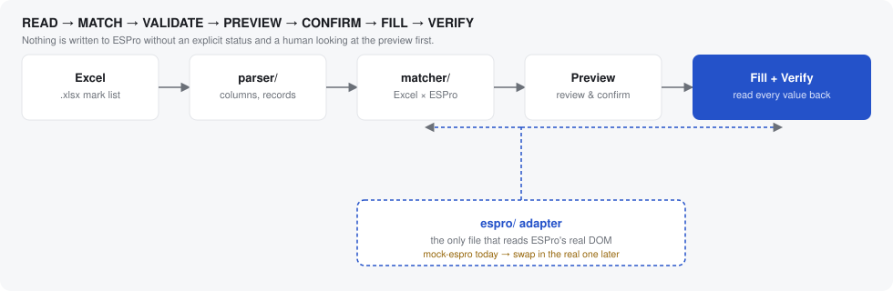

# Mark

**Fill ESPro marks from Excel — matched, previewed, and verified before anything is written.**

Every faculty member who has entered internal marks into ESPro knows the
routine: open a spreadsheet, find a student, find the same student on
screen, type the number, repeat — sixty, eighty, a hundred times, once per
section, once per assessment. It's slow, and one misread row means a mark
lands on the wrong student.

Mark is a Chrome extension that does the matching and typing for you —
but it never guesses. It reads your spreadsheet, matches every student
against ESPro by a real identifier (not row position, not fuzzy name
guessing), shows you exactly what it's about to change, and only writes
after you say so. Then it reads every field back to confirm the write
actually landed.

> **Status:** fully built and tested end-to-end against a faithful mock of
> a legacy ESPro-style marks page (see [Why a mock ESPro page](#why-a-mock-espro-page)).
> Swapping in the real ESPro DOM is a scoped, one-file change — see
> [`extension/src/espro/`](extension/src/espro/).

<p align="center">
  
</p>

## Why it's safe, not just fast

This is the part that actually matters. A wrong mark on the wrong student
is a much worse outcome than the tool doing nothing at all, so **Mark
never silently guesses**:

| It never... | It always... |
|---|---|
| Matches students by spreadsheet row position | Matches by a real identifier (USN / register number / roll number / student ID) |
| Overwrites a mark ESPro already has | Flags it and asks for explicit confirmation first |
| Picks one row when an identifier is duplicated | Blocks the fill and shows you every duplicate |
| Assumes a fuzzy name match is safe | Treats name-only matching as opt-in and always low-confidence |
| Submits or saves anything in ESPro | Stops after fill + verify — you press ESPro's own Save |
| Trusts that a fill "probably worked" | Reads every field back and reports Verified / Mismatch / Failed |

Every match gets one of nine explicit statuses — `MATCHED`, `NOT_FOUND`,
`DUPLICATE_EXCEL`, `DUPLICATE_ESPRO`, `MISSING_MARK`, `INVALID_MARK`,
`IDENTIFIER_CONFLICT`, `ALREADY_FILLED`, `LOW_CONFIDENCE` — never
collapsed into a generic "failed." You see the difference in the
preview table before a single field is touched.

## What it looks like

```
1. Import your .xlsx mark list         →  parsed locally, nothing leaves the browser
2. Peek at what was imported           →  identifier / name / mark, row by row
3. Open the ESPro marks page           →  Mark detects it and reads the visible students
4. Review the match preview            →  matched, not-found, duplicates, conflicts — all labeled
5. Fill                                →  writes only the clean matches (or explicitly-confirmed overwrites)
6. Verify                              →  every field read back and checked
7. You save/submit in ESPro yourself   →  Mark never touches that button
```

## Everything stays local

Parsing happens in the browser with [SheetJS](https://sheetjs.com/). The
parsed workbook lives in `chrome.storage.session` — in-memory, cleared
when the browser closes, never written to disk, never synced, never sent
anywhere. No backend, no external API, no analytics, no AI. Student data
never leaves the tab.

## Project layout

```
extension/       The Chrome extension (Manifest V3, TypeScript, React, Vite)
  src/
    popup/       Faculty-facing UI — import → review → preview → fill → verify
    content/     Runs on ESPro pages, answers messages from the app window
    background/  Service worker: session-only workbook storage + window management
    parser/      xlsx parsing + column detection            (pure, no DOM)
    matcher/     Excel × ESPro matching engine               (pure, no DOM)
    validation/  Mark validation                             (pure)
    espro/       The ONLY code that knows ESPro's actual DOM structure
    types/
  tests/         Vitest — 45 tests: parsing, matching, DOM discovery,
                 filling/verification, and edge cases (duplicates on
                 either side, blank identifiers, a page that changes
                 mid-fill, and more)
mock-espro/      Standalone mock of a legacy ESPro marks-entry page,
                 used for development and demos until the real DOM is in
sample-data/     A synthetic mark list (sample_marks.xlsx) engineered to
                 trigger every match status at once against the mock page
docs/            Architecture diagram
```

The `espro/` adapter pattern is the whole point of this layout: parsing,
matching, validation, and the UI never touch a selector directly. They
only ever see the normalized output of an `EsproPageAdapter`. Today
that's `mockAdapter.ts`, built against `mock-espro/`. Once the real ESPro
DOM is available, it becomes one new adapter file and a manifest URL
change — nothing upstream of it moves.

## Running the demo

**1. Serve the mock ESPro page** (port 8765, to match the extension's permissions):
```bash
cd mock-espro && python3 -m http.server 8765
```
Open http://localhost:8765/index.html to see it standalone.

**2. Build the extension:**
```bash
cd extension && npm install && npm run build
```

**3. Load it in Chrome:**
- Go to `chrome://extensions`
- Enable **Developer mode** (top right)
- **Load unpacked** → select `extension/dist`

**4. Try the flow:**
- Click the **Mark** toolbar icon — it opens a small, independent app
  window (not a browser tab; this is deliberate, see the note below)
- Drag in `sample-data/sample_marks.xlsx`, or use **Choose Excel file**
- Switch to the `localhost:8765` tab, then back in Mark click
  **Check ESPro page**
- The preview table is engineered to show one of every status at once —
  matched, not found, duplicates on both sides, an already-filled mark,
  an invalid mark, a missing mark, and identifier/name normalization
- Click **Fill**, then watch the verified/failed summary

`npm run dev` in `extension/` gives hot-reload during development instead
of a full rebuild per change.

<details>
<summary>Why a separate app window instead of the usual dropdown popup?</summary>

Chrome's toolbar dropdown popup auto-closes the instant it loses focus —
including the instant it opens a native file picker, which tears the
whole popup down mid-selection. Mark's toolbar icon is a one-shot
launcher: it asks the background service worker to open (or refocus) a
real, independent `chrome.windows.create` window, which behaves like any
other window and is safe to open native dialogs from. See
[`extension/src/background/index.ts`](extension/src/background/index.ts).
</details>

## Tests

```bash
cd extension && npm test        # 45 tests, no browser required
npm run typecheck
```

`parser/`, `matcher/`, and `validation/` are pure TypeScript with no DOM
or Chrome API dependency, so the matching logic is fully testable without
touching a real browser. `espro/` is tested against jsdom fixtures built
from mock-espro's actual rendered markup.

## Why a mock ESPro page

Guessing at a real system's DOM is exactly the kind of shortcut that
could put a mark on the wrong student — so nothing here assumes real
ESPro's HTML. `mock-espro/` reproduces the structural quirks a legacy,
server-rendered university ERP typically has: non-semantic
ASP.NET-WebForms-style control IDs, identifiers that are plain text with
no `data-*` attributes, client-side pagination, an already-filled field,
a duplicate identifier, and a malformed row with no identifier at all.
That let the matching, validation, and fill logic get built and tested
properly ahead of time. It gets replaced with the real thing — and only
that one file — as soon as it's available.

## Roadmap

- [ ] Swap in the real ESPro DOM adapter once available
- [ ] Multi-page walk (currently: one ESPro page per fill, by design —
      see the architecture notes in `extension/src/espro/`)
- [ ] Code-split the popup bundle (SheetJS + React currently ship as one
      ~600KB chunk; fine for a local extension, but splittable)
- [ ] Production hardening pass: permissions review, Chrome Web Store
      packaging, accessibility pass
